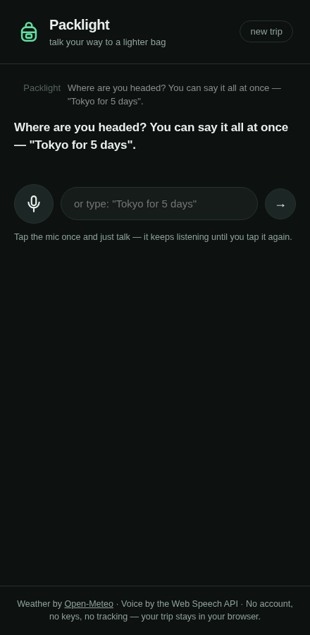
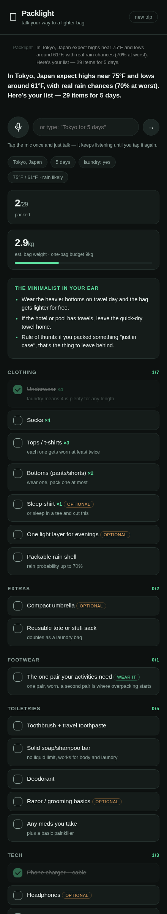

# Packlight

**Talk your way to a lighter bag.** Packlight is a voice-first, minimalist travel packing app. Tell it where you're going, how long, and what you're doing — it checks the weather and builds a packing checklist that actively pushes back against overpacking. Then check items off by voice while you pack.

**Live demo:** open `index.html?demo` to see a generated list without going through the conversation.

| Start of a trip | Generated list, mid-packing |
|---|---|
|  |  |


## What it does

- **Voice-first conversation** — "Tokyo for 5 days, and I'll be hiking and swimming." It asks the follow-ups that matter: departure date (for the forecast) and **laundry access**, the single biggest lever on how much clothing you need.
- **Weather-aware lists** — real forecast from Open-Meteo (free, no API key) drives layers, rain gear, and sun protection. Trip too far out for a forecast? It says so and packs for versatility.
- **Minimalism built in, not bolted on** — quantities scale with trip length *and* laundry access, heavy items are tagged "wear it" instead of packed, and every list comes with coach notes ("you packed that just in case — leave it").
- **One-bag budget** — estimated bag weight against a 9 kg carry-on budget, live as you check things off.
- **Hands-free packing mode** — say "check socks", "uncheck jacket", "what's left", "add chargers", "remove umbrella". The checklist stays on screen the whole time.
- **No account, no keys, no backend, no tracking** — trips persist in `localStorage`.

## Voice commands

| Say | Does |
|---|---|
| `check <item>` / `packed <item>` | marks it packed |
| `uncheck <item>` | brings it back |
| `what's left` | reads out remaining count + next items |
| `add <item>` / `remove <item>` | edits the list |
| `new trip` | starts over |

## Architecture

Plain HTML/CSS/JS — no build step, no dependencies.

```
index.html      structure
style.css       dark, minimal, mobile-first
js/packing.js   the packing engine (deterministic rules, weather- and laundry-aware; also runs in Node)
js/voice.js     Web Speech API wrapper (recognition + synthesis)
js/app.js       conversation state machine, Open-Meteo fetch, rendering
```

Design notes:

- The checklist engine is **transparent rules, not a black box** — every quantity is explainable (days ÷ wears, capped by laundry). To use an LLM instead, swap `PackingEngine.buildList` for a call to a small serverless proxy; never ship an API key in the client.
- Voice input uses the Web Speech API (Chrome, Edge, Safari). Typing works everywhere and does everything voice does.
- Weather: Open-Meteo geocoding + forecast, 16-day window, CORS-open, no key.

## Run locally

Any static server works:

```bash
python3 -m http.server 8000
# open http://localhost:8000
```

## Deploy (free)

**GitHub Pages** — from this repo: Settings → Pages → deploy from branch → `main` / root. Live at `https://<username>.github.io/<repo>/` in about a minute.

**Netlify Drop** — drag this folder onto [app.netlify.com/drop](https://app.netlify.com/drop). Instant URL, no CLI.

Voice input requires HTTPS (or localhost) — both options give you that.

## Ideas for v2

- Swap the rule engine for an LLM behind a tiny proxy for fuzzier requests ("a conference but I sneak in morning runs")
- Shareable list links
- Seasonal climate norms for trips beyond the forecast window
